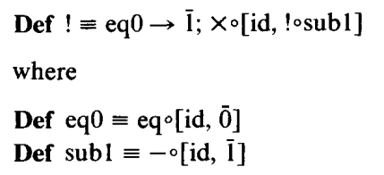
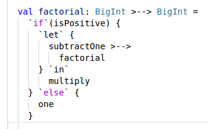

# Program Description Based Programming

## Warning

Expect frequent changes. In the file Changes.md, we describe some of the more important changes. 

## Introduction

When writing an introduction it is challenging to find the right balance between providing *too many details* or *too few details*. This introduction provides many details. It is perfectly fine to read it diagonally.

Before starting, let's present a bit of history.

### History

In 1977, John Backus was an [ACM A.M. Turing Award](http://amturing.acm.org/) winner. The title of his Turing Award winning lecture was 

*Can programming be liberated from the von Neumann style? A functional style and it's algebra of programs.*

This project builds upon the ideas of this influential lecture.


### `FP`

In his Turing Award winning lecture, John Backus describes a [*function level programming language* `FP`](https://en.wikipedia.org/wiki/FP_%28programming_language). 

The `FP` programming language consists of *objects*, *programs*, *forms* and *definitions*, where

 - A program transforms objects to an object.
 - A form transforms programs to a program.
 - A definition defines a program or a form in terms of programs and forms.

The `FP` forms are 

 - *Function*
 - *Composition*
 - *Construction*
 - *Condition*
 - *Aggreation*

`FP` does not really have an aggregation form. It does have objects that are *sequences* of objects. We included aggregation since it consists of, somehow, reducing objects of a structure of objects (for example a sequence of objects) to a single object.

### Mapping from `FP` to `Dotty`

In this project, we develop a *program description library* that is written in the [`Dotty` *programming language*](http://dotty.epfl.ch/). The main `trait` of the library is `trait Program`, a *type class* that closely resembles `FP`.

Below is the logo of the library

```scala
    //       _______         __    __        _______
    //      / ___  /\       / /\  / /\      / ___  /\
    //     / /__/ / / _____/ / / / /_/__   / /__/ / /
    //    / _____/ / / ___  / / / ___  /\ /____  / /
    //   / /\____\/ / /__/ / / / /__/ / / \___/ / /
    //  /_/ /      /______/ / /______/ /     /_/ /
    //  \_\/       \______\/  \______\/      \_\/
    //                                           v1.0
    //  Program Description Based Programming Library
    //  author        Luc Duponcheel        2017-2018
```

Below is the definition of `trait Program`

```scala
trait Program[>-->[- _, + _]]
    extends Function[>-->]
    with Composition[>-->]
    with Construction[>-->]
    with Condition[>-->]
    with Aggregation[>-->]
    with Execution[>-->]
```
The `FP` forms to `trait`'s that are mixed-in by `trait Program`.

*Program descriptions* are defined in terms of the *programming capabilities* that are *declared* in `trait Program`. A *meaning* of a program description is defined by defining an `implicit object` that *defines* the programming capabilities that are declared in `trait Program`. A specific meaning can be made available using a technique, *dependency injection by* `import`, that will be used a lot in our library. For *type classes*, dependency injection in `Dotty` is as simple as doing an appropriate `import`. 

By abuse of notation, we are often going to refer to both *program descriptions* and their *meaning* them as *programs*. We hope that this will not lead to any confusion (especially since *program* is, generally, used to refer to *code written in some programming language*). 

There is are important differences between `FP` programs and `Dotty` programs (program *descriptions*, remember). Exploiting the flexibility that comes with those differences is one of the most important themes of this project. 

 - `FP` programs are *language* based.
 - `Dotty` programs are *library* based.

Therefore

 - in `FP`
   - programs have only *one* meaning,
   - forms cannot be extended.
 - in `Dotty`
   - programs can have *many* meanings,
   - `trait Program` can be extended.

Different meanings can be defined by defining the members of `trait Execution`.

For example:

 - *One* `Dotty` program for `factorial` can have both a meaning that is *not* tail recursive and a meaning that *is* tail recursive.
 - *extra programming capabilities* can be added such as
   - input reading,
   - output writing,
   - state manipulation,
   - failure handling,
   - latency handling (using parallelism),
   - advanced control beyond conditional control (using delimited continuations),
   - ...

In a way programs generalize *functions*. A *function application* (more precisely, the *evaluation* of a *function application expression*) transforms *function arguments* to yield a *function result*. A *program execution* also, *somehow*, transforms *program arguments* to yield a *program result*. When there is no danger of confusion we are simply going to write *arguments* and *result* (not mentioning *function* or *program*).

Our library is also about *computation descriptions*. They are similar to program descriptions. By abuse of notation, we are also often going to refer to both *computation descriptions* and their *meaning* them as *computations*. 

In a way computations generalize *expressions*. An *expression evaluation* yields an *expression result*. A *computation execution* also, *somehow*, yields a *computation result*. When there is no danger of confusion we are simply going to write *result* (not mentioning *function* or *computation*).

Below are some `Dotty` REPL (Read-Eval-Print-Loop) sessions to illustrate the difference between a *description* and it's *meaning*. The `Dotty` code below does *not* deal with programming capabilities or computational capabilities *at all*. Instead it simply deals with *element* related capabilities.

```scala
scala> trait Element[E] {
         val element: E
       }   
defined trait Element
scala> trait Function[E] {
         def function(e: E): E
       }   
defined trait Function
```

Above are two `Dotty` *type classes* for a type `E` declaring element related capabilities.

 - `trait Element[E]` declares `E`s capability to have an element, `element`.
 - `trait Function[E]` declares `E`'s capability to have an function, `function`, that transforms an argument element `e` to yield a result element `function(e)`.

Given those *declarations* we can already start *defining* some *element descriptions* as illustrated below

```scala
scala> trait SomeElement[E : Element : Function] {
         val implicitFunction = implicitly[Function[E]]
         import implicitFunction._
         
         val implicitElement = implicitly[Element[E]]
         import implicitElement._
         
         val someElement = function(element)  
       }   
defined trait SomeElement 
```

The code above defines `trait SomeElement[E : Element : Function]`, that declares `E` to *implicitly* have the element related capabilities above. The code defines an element description `someElement` in terms of those capabilities. Think of the element description as a *recipe*:

 - Take `element` and apply `function` to it to make `someElement`.

At this moment there is *no definition* of the declared capabilities available yet. Let's go ahead and introduce an *implicit definition* of those declared capabilities for the type `Int`:

```scala
scala> implicit object naturalNumbers extends
         Element[Int] with Function[Int] {
         
         override val element: Int = 0
         
         override def function(i: Int): Int = i + 1
         
       }   
defined module naturalNumbers
scala> object someIntElement extends SomeElement[Int]() 
defined module someIntElement
scala> import someIntElement.someElement
import someIntElement.someElement
```

The code above defines `implicit object naturalNumbers` (modeling *natural numbers*). Note that, a long as we keep `Dotty`'s type system happy, we have the *full flexibility* to define `element` and `function` in *any* way we want. We could have modeled *even natural numbers* by replacing `1` by `2`. The code above makes `someElement`, an element of type `Int` available using *dependency injection by* `import`. Now that we have *defined* `E` to be `Int`, we write *element*. When `E` was *declared* we wrote *element description*. Remember that for program descriptions and computation descriptions our notation is *not* going to be so precise. Let's go ahead and use `someElement`

```scala
scala> someElement 
val res0: Int = 1
```

### Pointfree versus Pointful

The `FP` programming language imposes a *pointfree programming style* (think of *function level* and *pointfree* as synonyms).

The programming capabilities of `trait Program` also impose a pointfree programming style.
The computational capabilities of `trait Computation` allow a *pointful programming style*(think of *object level*, *value level* and *pointful* as synonyms).

Our library promotes a pointfree programming style. Therefore

 - We declare the members of the `trait Program` to be `public`.
 - We declare the members of the `trait Computation` to be `package` `private`.

### Foundations

Describing programs, resp. computations, using program descriptions, resp. computation descriptions, is not new.

In 1991, Eugenio Moggi introduced *monads* as a *computation* foundation in
[*Notions of computation and monads*](http://citeseerx.ist.psu.edu/viewdoc/download?doi=10.1.1.79.733&rep=rep1&type=pdf).

In 1992, Philip Wadler used monads in `Haskell` in [*The essence of functional programming*](http://citeseerx.ist.psu.edu/viewdoc/download;jsessionid=E09A5FD9362F6780675ADF29471B7428?doi=10.1.1.38.9516&rep=rep1&type=pdf).

In 1998, John Hughes introduced *arrows* as a *program* foundation and used arrows in `Haskell`
[*Generalizing monads to arrows*](http://citeseerx.ist.psu.edu/viewdoc/download?doi=10.1.1.29.4575&rep=rep1&type=pdf).

In 2008, Conor McBride and Ross Paterson introduced *applicatives* (a.k.a. *idioms*) as a *computation* foundation and used applicatives in `Haskell` in [*Applicative programming with effects*](http://www.staff.city.ac.uk/~ross/papers/Applicative.pdf).

In 2008, Sam Lindley, Philip Wadler and Jeremy Yallop compared the *power of expression* of those three foundations in [*Idioms are oblivious, arrows are meticulous,
monads are promiscuous*](http://citeseerx.ist.psu.edu/viewdoc/download?doi=10.1.1.187.6750&rep=rep1&type=pdf). Monads have most power of expression. Applicatives have least power of expression. 

Monads naturally lead to a pointful programming style. Monad based computations can use a pointfree programming style by making use of [*Kleisli functions*](https://en.wikipedia.org/wiki/Kleisli_category). Arrows naturally lead to a pointfree programming style. Arrow based programs can use a pointful programming style by making use of [*The arrow calculus*](http://homepages.inf.ed.ac.uk/slindley/papers/arrow-calculus.pdf).

*Our library goes for programming monads in a pointfree style using Kleisli functions.*

### Why `Dotty`

Program description based programming is not only about *power of expression*, it is also, and probably even more, about *elegance of use*. Traditionally, the pointfree style has *not* been considered to be very elegant. Luckily, the `Dotty` programming language comes to the rescue! `Dotty` is a *strongly typed*, *scalable* programming language. It is possible to *extend the language* in a *type safe* way at the *library* level with *internal domain specific languages*. By using a domain specific language for the domain of *programs*, program description based programming can be done in a very *concise* way.

Below are both an `FP` example and a `Dotty` example illustrating difference in elegance of use.

#### `FP factorial`



#### `Dotty factorial`



Of course, elegance of use is a highly subjective concept. Maybe, if you are mathematically inclined, you may consider the `FP` example below to be more elegant. However, if you are a mainstream programmer, you, most probably, consider the `Dotty` example below to be more elegant.

### Main goal of the library

The main *goal* of the library is to illustrate that program description based programming using a pointfree style in `Dotty` is 

 - *powerful* : you can use the full expressive power of monads
 - *elegant* : you can use a concise `Dotty` DSL syntax
 - *flexible* : you can define many meanings
 - *extendible* : you can introduce extra capabilities by need

We claim that program description based programming using a pointfree style
*naturally leads to deep insights into the nature of programming and computation*
since it requires you to reason at an *appropriate level of abstraction*. 

### More about descriptions

Below is a comparision between the universe of *programs* and the universe of *paintings*.

Program descriptions *are* programs (code that is written using a programming language), and giving a *meaning* to program descriptions happens in the universe of programs (code that is written using a programming language). Note that we have been a bit sloppy with our vocabulary, but, hopefully, you get the point.

Compare this with


What is figure above all about?

René Magritte, the painter of [*Ceci n'est pas une pipe*](https://en.wikipedia.org/wiki/The_Treachery_of_Images) was right. His painting *is not a pipe* : it is a *painting* that is a *description of a pipe*. Note that, giving a *meaning* to paintings happens in a universe that is totally different from the universe of paintings. It happens in the universe of human minds.

### Summary

For some of you this introduction may have touched upon a lot of frightening stuff.
But, really, for now you only have to concentrate on *power of expression*,
*elegance of use* and *flexibility of meaning*. Hopefully this will sound exiting to both programmers *with* and programmers *without* a background in computer science.

## `Program`

### Warning

This document contains a lot of code. When reading it in sequential order, you will often be confronted with the word *Consider* followed by code that has not been explained yet. Do not worry, the code will be explained in the paragraph immediately below it. 

### `Program`

Consider

```scala
package pdbp.program

trait Program[>-->[- _, + _]]
    extends Function[>-->]
    with Composition[>-->]
    with Construction[>-->]
    with Condition[>-->]
    with Aggregation[>-->]
    with Execution[>-->]
```
where

```scala
trait Function[>-->]

trait Composition[>-->]

trait Construction[>-->]

trait Condition[>-->]

trait Aggregation[>-->]

trait Execution[>-->]
```

belong to the same `package pdbp.program`.

We strongly suggest you to write the code yourself to get a feeling of the development of the library. At this moment the code can be compiled (I recommend to use [`sbt`](https://www.scala-sbt.org/)).

```scala
$ sbt
[info] Loading global plugins from /home/lucd/.sbt/0.13/plugins
[info] Loading project definition from /opt/home/blog/ProgramDescriptionBasedProgramming/pdbp/project
[info] Set current project to pdbp (in build file:/opt/home/blog/ProgramDescriptionBasedProgramming/pdbp/)
> compile
[info] Compiling 7 Scala sources to /opt/home/blog/ProgramDescriptionBasedProgramming/pdbp/target/scala-0.6/classes...
[success] Total time: 3 s, completed Jan 26, 2018 11:11:50 AM
```

`trait Program` is a *type class* that will gradually be explained later in this document. `trait Function`, `trait Composition`, `trait Construction`, `trait Condition` and `trait Execution` will be explained later in this section. `trait Aggregation` will be explained later in this document. `trait Program` declares *programming capabilities* of *program descriptions*. The programming capabilities of `Function`, `Composition` and `Construction` correspond to *arrows*. 

Note that we were a bit sloppy by not showing `[>-->]`

Recall that we are often going to write *program* instead of *program description*.

A *program* is an `object` of type `Z >--> Y`.

 - `>-->` is a *binary type constructor*,
 - `Z` is the *parameter* (or *argument*) type of `>-->`,
 - `Y` is the *return* (or *result*) type of `>-->`.

We'll write *parameter* resp. *return* at the *delaration* (or *definition*) site and we will write *argument* resp. *result* at the *usage* site.

Note that `>-->` is

 - *contravariant* in its parameter type,
 - *covariant* in its return type.

This is consistent with

 - The [*Liskov Substitution Principle*](https://en.wikipedia.org/wiki/Liskov_substitution_principle) which states: *require less* and *provide more*. 
 - [*Internet Robustness principle Principle*](https://en.wikipedia.org/wiki/Robustness_principle) which states: *be conservative in what you send, be liberal in what you accept*.

Below we illustrate this for *functions* (recall that programs, somehow, generalize functions)

 ```scala
scala> trait SuperZ  
defined trait SuperZ
scala> trait Z extends SuperZ 
defined trait Z
scala> trait Y 
defined trait Y
scala> trait SubY extends Y 
defined trait SubY
scala> val z2y: Function[Z, Y] = new Function[SuperZ, SubY] { override def apply(superZ: SuperZ): SubY = ??? } 
val z2y: Z => Y = <function1>
```

Note that a program has *one* parameter (or argument). In the section about `trait Construction` we explain how we deal with *many* parameters (or arguments).

### `Function`

Consider

```scala
package pdbp.program

trait Function[>-->[- _, + _]] {

  def function[Z, Y](`z=>y`: Z => Y): Z >--> Y

}
```

`` function(`z=>y`) `` is a program that behaves as function `` `z=>y` ``. Function `` `z=>y` `` is supposed to be a *pure function* doing nothing else than transforming argument `z` of type `Z` to a result `` y == `z=>y`(z) `` of type `Y`.

For *generic function names*, we use *mixed alphabetic and symbolic characters within backticks*, like `` `z=>y` `` to, hopefully, improve readability. We agree that this is an unusual naming convention. We know programers who hate it, we know programmers who love it. Let's explain the reason of this naming convention with some examples that are special cases of [Theorems for free!](http://homepages.inf.ed.ac.uk/wadler/papers/free/free.dvi), as explained by Philip Wadler.

 - There is really only *one* function of type `Z => Z` *for all* `Z`: the *identity function*. The name `` `z=>z` ``, hopefully, suggests this function.
 - There is really only *one* function of type `(Z, Y) => Z` *for all* `Z` and `Y`: the *left projection function*. The name `` `(z,y)=>z` ``, hopefully, suggests this function.
 - There is really only *one* function of type `(Z, Y) => Y` *for all* `Z` and `Y`: the *right projection function*. The name `` `(z,y)=>y` ``, hopefully, suggests this function.
 - There is really only *one* function of type `(Z => Y, Z) => Y` *for all* `Z` and `Y`: the *function application function*. The name `` `(z=>y,z)=>y` ``, hopefully, suggests this function.

Ok, we could have named those functions `identity`, `leftProjection`, `rightProjection`, `functionApplication` or something similar. Sometimes you simply run out of meaningful generic names. The main benefit of the *generic backtick names* comes when trying to understand the type of *complex* expressions. `` `z=>y`(z) `` is an example of a *simple* expression where, hopefully, it should be clear that it has type `Y`. When dealing with more complex expressions having nested expressions, the usefulness of those generic backtick names becomes more apparent. For all this to work, we'll introduce synonyms like `` `y=>y` ``, `` `x=>x` ``, etc. by need (when types `Y`, `X`, etc. are involved).

Consider

```scala
package pdbp.utils

object functionUtils {

  def `z=>z`[Z]: Z => Z = { z =>
    z
  }

}
```

The definition of the *generic function utility* `` `z=>z` `` is the one you expect. We will gradually add more generic function utilities.

Consider

```scala
  def `z>-->z`[Z]: Z >--> Z =
    function(`z=>z`)  
```

Add the definition of `` `z>-->z` `` to `trait Function`. Do not forget to do an appropriate `import`. Check if your code compiles. We defined `` `z>-->z` `` in terms of `function` and `` `z=>z` ``. For programs, we use generic backtick names like `` `z>-->y` `` to, hopefully, improve readability. You may have doubts about the usefulness of `` `z>-->z` ``. It turns out that, when defining more complex *composite programs*, composed from *program components* , replacing one or more of the components by `` `z>-->z` `` results in interesting programs of their own.

### `Composition`

Consider

```scala
package pdbp.program

trait Composition[>-->[- _, + _]] {

  def compose[Z, Y, X](`z>-->y`: Z >--> Y, `y>-->x`: => Y >--> X): Z >--> X

}
```

`composition` make a  *program* `` composition(`z>-->y`, `y>-->x`) `` that is *composed* from *simpler programs*, `` `z>-->y` `` and `` `y>-->x` ``.

The program `` composition(`z>-->y`, `y>-->x`) `` is the *sequential composition* of the program `` `z>-->y` `` and the program `` `y>-->x` ``. The result of program `` `z>-->y` `` is the argument of the *subsequent* program `` `y>-->x` ``. Note that `` `y>-->x` `` is a *call-by-name parameter*. Program `` `z>-->y` `` may *fail*. 

Consider

```scala
object compositionOperator {

  implicit class CompositionOperator[>-->[- _, + _]: Composition, -Z, +Y](
      `z>-->y`: Z >--> Y) {

    def >-->[X](`y>-->x`: => Y >--> X) =
      implicitly.compose(`z>-->y`, `y>-->x`)

  }

}
```

`compose` comes with an *operator* equivalent `>-->`. Put `object compositionOperator` in the same file as `trait Composition`. Note that in

```scala
scala> import pdbp.program.Program
scala> import pdbp.program.compositionOperator._
scala> trait Example[>-->[- _, + _] : Program] {
         type Z
         type Y
         type X
         val `z>-->y`: Z >--> Y
         val `y>-->x`: Y >--> X
         val `z>-->x`: Z >--> X = `z>-->y` >--> `y>-->x`
       }
// defined trait Example
```

 - the expression `` `z>-->y` >--> `y>-->x` ``, especially it's matching `y`'s, reflects the type involved, 
 - the program `` `z>-->x` `` has type `Z >--> X`. 

Hopefully this illustrates the usefulness of appropriate generic backtick names.


### `Construction`

Consider

```scala
package pdbp.program

import pdbp.utils.productUtils._

trait Construction[>-->[- _, + _]] {
  this: Function[>-->] & Composition[>-->] =>

  def product[Z, Y, X](`z>-->y`: Z >--> Y,
                       `z>-->x`: => Z >--> X): Z >--> (Y && X) =
    product(`z>-->y`, `z>-->x`, `(y&&x)>-->(y&&x)`)

  def product[Z, Y, X, W](`z>-->y`: Z >--> Y,
                          `z>-->x`: => Z >--> X,
                          `(y&&x)>-->w`: => (Y && X) >--> W): Z >--> W =
    compose(product(`z>-->y`, `z>-->x`), `(y&&x)>-->w`)

  def and[Z, X, Y, W](`z>-->x`: Z >--> X,
                      `y>-->w`: => Y >--> W): (Z && Y) >--> (X && W) =
    product(compose(`(z&&y)>-->z`, `z>-->x`), compose(`(z&&y)>-->y`, `y>-->w`))

  def `let`[Z, Y, X](`z>-->y`: Z >--> Y): In[Z, Y, X] =
    new In[Z, Y, X] {
      def `in`(`(z&&y)>-->x`: => (Z && Y) >--> X): Z >--> X =
        compose(product(`z>-->z`, `z>-->y`), `(z&&y)>-->x`)
    }

  trait In[Z, Y, X] {
    def `in`(`(z&&y)>-->x`: => (Z && Y) >--> X): Z >--> X
  }

}
```

where

 - `type &&[+Z, +Y] = (Z, Y)` is a type alias
 - `` `(y&&x)>-->(y&&x)` `` is the program you expect,
 - `` `(z&&y)>-->z` `` is the program you expect,
 - `` `(z&&y)>-->y` `` is the program you expect.

Add the programs above to `trait Function` and put the corresponding *product utilities* and the type `&&` in `object productUtils` in `package pdbp.utils`.

`product` makes a *program* `` product(`z>-->y`, `z>-->x`) `` that *constructs a result from the results of simpler programs*, `` `z>-->y` `` and `` `z>-->x` `` .

If `` `z>-->y` `` has a result `y` of type `Y`, and `` `z>-->x` `` has a result `x` of type `X`, then `` product(`z>-->y`, `z>-->x`) `` has a result `(y, x)` of type `Y && X`.

Think of one object of type `Y && X` as both an object `y` of type `Y` and an object `z` of type `Z`. This is the way we deal with *two* results of a program and *two* arguments of subsequent programs.

`trait Construction` has three other members

 - `product[Z, Y, X, W]` is a more complex version of `product[Z, Y, X]`,
 - `and[Z, Y, X, W]` is yet another more complex version of `product[Z, Y, X]`,
 - `` `let`[Z, Y, X] `` has a parameter that is a program that *creates a new result*, and `` `in` `` has a parameter that has that result available as an *extra argument*.

Note that

 - `product[Z, Y, X]` can be defined in terms of `product[Z, Y, X, W]` and `` `(y&&x)>-->(y&&x)` ``,
 - `product[Z, Y, X, W]` can be defined in terms of `product[Z, Y, X]` and `compose`,
 - `and[Z, Y, X, W]` can be defined in terms of `product[Z, Y, X]`, `` `(z&&y)>-->z` ``, `` `(z&&y)>-->y` `` and `compose`,
 - `` `let`[Z, Y, X] `` and `` `in` `` can be defined in terms of `product`, `` `z>-->z` `` and `compose`.

`` `let` { /* ... */ } `in` { /* ... */ } `` is a first example where `Dotty` comes to the rescue to spice *pointfree programming* with some *domain specific language* flavor.

Finally, note that the definitions are *left biased*. The argument for the first by-value parameter is always evaluated. The argument for the second by-name parameter may not be evaluated. 

#### Example

`product[Z, Y, X]` in terms of `` `let` `` and `` `in` ``.

```scala
package examples

import pdbp.utils.productUtils._

import pdbp.program.Function
import pdbp.program.Composition
import pdbp.program.Construction

import pdbp.program.compositionOperator._

trait ProductInTermsOfLetAndIn[
    >-->[- _, + _]: Function: Composition: Construction] {
  val implicitFunction     = implicitly[Function[>-->]]
  val implicitConstruction = implicitly[Construction[>-->]]

  import implicitFunction._
  import implicitConstruction._

  def product[Z, Y, X](`z>-->y`: Z >--> Y,
                       `z>-->x`: => Z >--> X): Z >--> (Y && X) =
    `let` {
      `z>-->y`
    } `in` {
      `let` {
        `(z&&y)>-->z` >--> `z>-->x`
      } `in` {
        `((z&&y)&&x)>-->(y&&x)`
      }
    }

}
```
This exercise is an example of a recurring theme of our library: defining a program description, or programming capability, often boils down to a *getting the types right puzzle*. Often there is only *one meaningful way* to get them right. Let's have a look at some of the details of the puzzle for this exercise.

The outer `` `let` `` creates, using `` `z>-->y` ``, a new argument for the outer `` `in` `` (which has an argument of type `Z && Y` available, representing two arguments, one of type `Z` and one of type `Y`). The main difference between `` `let` `` and `compose` is that `` `let` `` does *not* loose the original argument of type `Z`. The inner `` `let` `` creates, using `` `(z&&y)>-->z` >--> `z>-->x` ``, the composition of `` `(z&&y)>-->z` `` and `` `z>-->x` ``, a new argument for the inner `` `in` `` (which has an argument of type `(Z && Y) && X` available, representing three arguments, one of type `Z`, one of type `Y`, and one of type `X`). The inner `` `in` `` simply gets rid of the original argument of type `Z` using `` `((z&&y)&&x)>-->(y&&x)` ``.

The programs `` `(z&&y)>-->z` `` and  `` `((z&&y)&&x)>-->(y&&x)` `` are the ones you expect. Add the latter one (and the corresponding function) to the appropriate files.

Note that generic backtick names help to understand the puzzle. In the composition `` `(z&&y)>-->z` >--> `z>-->x` ``, the matching `z`'s reflect the type involved. In the name `` `((z&&y)&&x)>-->(y&&x)` ``, both `((z&&y)&&x)` and `(y&&x)` reflect the type involved. 

One challenge that comes with pointfree programming is getting the *arguments that are needed* out of *all arguments*. One way to deal with this challenge is to keep programs, and therefore, the arguments that come with them, relatively small. After all, small programs can be combined to larger ones by using programming capabilities, most notably, sequential composition. [*Erik Meijer*](https://en.wikipedia.org/wiki/Erik_Meijer_(computer_scientist)) refers to this programming paradigm in a somewhat funny way as *good programmers write baby-code.* Erik Meijer is so famous that he does not need an introduction. I was very lucky to be able to do research with him, on monads and related stuff, at the Univeristy of Utrecht back in the ninetees.

Consider

```scala
object constructionOperators {

  implicit class ConstructionOperators[>-->[- _, + _]: Construction, -Z, +Y](
      `z>-->y`: Z >--> Y) {

    def &[ZZ <: Z, X](`zz>-->x`: => ZZ >--> X) =
      implicitly.product(`z>-->y`, `zz>-->x`)

    def &&[X, W](`x>-->w`: => X >--> W) =
      implicitly.and(`z>-->y`, `x>-->w`)

  }

}
```

`product[Z, Y, X]` comes with an *operator* equivalent `&`, and `and[Z, Y, X, W]` comes with an *operator* equivalent `&&`. Put `object constructionOperators` in the same file as `trait Construction`. 

### `Condition`

Consider 

```scala
import pdbp.utils.productUtils._
import pdbp.utils.sumUtils._

trait Condition[>-->[- _, + _]] {
  this: Function[>-->] & Composition[>-->] & Construction[>-->] =>

  def sum[Z, Y, X](`y>-->z`: => Y >--> Z,
                   `x>-->z`: => X >--> Z): (Y || X) >--> Z =
    sum(`(y||x)>-->(y||x)`, `y>-->z`, `x>-->z`)

  def sum[Z, Y, X, W](`w>-->(y||x)`: W >--> (Y || X),
                      `y>-->z`: => Y >--> Z,
                      `x>-->z`: => X >--> Z): W >--> Z =
    compose(`w>-->(y||x)`, sum(`y>-->z`, `x>-->z`))

  def or[Z, X, Y, W](`x>-->z`: => X >--> Z,
                     `w>-->y`: => W >--> Y): (X || W) >--> (Z || Y) =
    sum(compose(`x>-->z`, `z>-->(z||y)`), compose(`w>-->y`, `y>-->(z||y)`))

  def `if`[W, Z](`w>-->b`: W >--> Boolean): Apply[W, Z] =
    new Apply[W, Z] {
      override def apply(`w>-t->z`: => W >--> Z): Else[W, Z] =
        new Else[W, Z] {
          override def `else`(`w>-f->z`: => W >--> Z): W >--> Z =
            sum(`let`(`w>-->b`) `in` `(w&&b)>-->(w||w)`, `w>-t->z`, `w>-f->z`)
        }
    }

  trait Apply[W, Z] {
    def apply(`w>-t->z`: => W >--> Z): Else[W, Z]
  }

  trait Else[W, Z] {
    def `else`(`w>-f->z`: => W >--> Z): W >--> Z
  }

}
```
where

 - `type ||[+Z, +Y] = Left[Z] | Right[Y]`, where `case class Left[+Z](z: Z)` and `case class Right[+Y](y: Y)`,
 - `` `(y||x)>-->(y||x)` `` is the program you expect,
 - `` `z>-->(z||y)` `` is the program you expect,
 - `` `y>-->(z||y)` `` is the program you expect.

Add the programs above to `trait Function` and put the corresponding *sum utilities* and the types `||`, `Left` and `Right` in `object sumUtils` in `package pdbp.utils`.

`` `(w&&b)>-->(w||w)` ``, where `b` corresponds to the type `Boolean` is also what you expect. There are two natural implementations, choose the one where `true` corresponds to `Left` and  `false` corresponds to `Right`.

Add the program above to `trait Function` and put the corresponding *product and sum utility* in `object productAndSumUtils` in `package pdbp.utils`.

`sum` makes a *program* `` sum(`y>-->z`, `x>-->z`) `` that  uses a *"left or right" condition* to behave either as a *simpler program* `` `y>-->z` `` or as a *simpler program* `` `x>-->z` ``.

 - `sum[Z, Y, X, W]` is a more complex version of `sum[Z, Y, X]`,
 - `or[Z, X, Y, W]` is yet another more complex version of `sum[Z, Y, X]`,
 - `` `if`[W, Z]} `` has a parameter that is a program that has a result of type `Boolean` that is used to *choose* between the parameter of `apply` or the parameter of `` `else` ``.

Note that

 - `sum[Z, Y, X]` can be defined in terms of `sum[Z, Y, X, W]` and `` `(y||x)>-->(y||x)` ``,
 - `sum[Z, Y, X, W]` can be defined in terms of `sum[Z, Y, X]` and `compose`,
 - `and[Z, Y, X, W]` can be defined in terms of `product[Z, Y, X]`, `` `(z&&y)>-->z` ``, `` `(z&&y)>-->y` `` and `compose`,
 - `` `if`[W, Z] `` and `` `else` `` can be defined in terms of `sum`, `` `let` `` and `` `in` ``.

`` `if`('/* ... */) { /* ... */ } `else` { /* ... */ } `` is a second example where `Dotty` comes to the rescue to spice *pointfree programming* with some *domain specific language* flavor. 

Note that this syntax is syntactic sugar for `` `if`('/* ... */) apply { /* ... */ } `else` { /* ... */ } ``.

#### Example

`sum[Z, Y, X]` in terms of `` `if` `` and `` `else` ``.

```scala
package examples

import pdbp.utils.sumUtils._

import pdbp.program.Function
import pdbp.program.Composition
import pdbp.program.Condition

import pdbp.program.compositionOperator._

trait SumInTermsOfIfAndElse[>-->[- _, + _]: Function: Composition: Condition] {
  val implicitFunction  = implicitly[Function[>-->]]
  val implicitCondition = implicitly[Condition[>-->]]

  import implicitFunction._
  import implicitCondition._

  def sum[Z, Y, X](`y>-->z`: => Y >--> Z,
                   `x>-->z`: => X >--> Z): (Y || X) >--> Z =
    `if`(`(y||x)>-->b`) {
      `(y||x)>-->y` >--> `y>-->z`
    } `else` {
      `(y||x)>-->x` >--> `x>-->z`
    }

}
```

The programs `` `(y||x)>-->y` `` and `` `(y||x)>-->x` `` are the ones you expect. Add them (and corresponding function) to the appropriate files. The program `` `(y||x)>-->b` `` is the one you expect. There are two natural implementations, choose the one where `Left` corresponds to `true` and  `Right` corresponds to `false`. Add it (and the corresponding function) to the appropriate files.

### `Execution`

Consider

```scala
package pdbp.program

trait Execution[>-->[- _, + _]] {

  def execute(`u>-->u`: Unit >--> Unit): Unit

}
```

A program `` `z>-->y` `` of type `Z >--> Y` can be composed

 - at the left with a *producer* `` `u>-->z` `` of type `Unit >--> Z`,
 - at the right with a *consumer* `` `y>-->u` `` of type `Y >--> Unit`.

to obtain a program `` `u>-->z` >--> `z>-->y` >--> `y>-->u` `` of type `Unit >--> Unit`. It is a program of that type that \ttb{execute} expects as an argument. Producers and consumers do the *input/output* work. For example, a producer can read from a file and a consumer can write to a socket.

### `factorial` example

`factorial` program in terms of `` `let` `` and `` `in` ``.

```scala
package examples.program

import pdbp.program.Program

trait FactorialTrait[>-->[- _, + _]: Program] {

  val implicitProgram = implicitly[Program[>-->]]

  import implicitProgram._

  import pdbp.program.compositionOperator._

  // add helper programs here

  lazy val factorial: BigInt >--> BigInt =
    `if`(isPositive) {
      `let` {
        subtractOne >-->
          factorial
      } `in`
        multiply
    } `else` {
      one
    }

}    
```
Where the helper programs `isPositive`, `subtractOne`, `multiply` and `one` are what you expect. Add the helper programs to `trait FactorialTrait`, and add the corresponding functions to `object functionUtils` in `package examples.utils`.

The definition above is, perhaps, the most concise *pointfree* definition of `factorial` one can think of. Remember that `` `let` `` creates a new result, 
`factorial(i-1)`, so that `multiply` can apply itself to `(i, factorial(i-1))`. Note that, in the explanation above, we introduced a *name* for the *point* `i` to explain what is going on behind the *pointfree* scenes. The `Dotty` definition above describes `factorial` at a somewhat higher level. Hopefully, after fully understanding the used programming capabilities, you will, eventually, agree that the pointfree program description of `factorial` above is as readable as the factorial programs that you are used to.

For those who want to be more *verbose*, it is perfectly possible to, *somehow*, be *pointful* as well. The definition below is *not* pointful. Although it *looks* like being pointful, there is one important difference: the local `val`'s are *programs*.

```scala
  lazy val pointfulFactorial: BigInt >--> BigInt = {
    val i: BigInt >--> BigInt =
      `z>-->z`
    `if`(i >--> isPositive) {
      `let` {
        i >-->
          subtractOne >-->
          pointfulFactorial
      } `in` {
        val `i&&factorial(i-1)` : (BigInt && BigInt) >--> (BigInt && BigInt) =
          `z>-->z`
        `i&&factorial(i-1)` >-->
          multiply
      }
    } `else` {
      i >-->
        one
    }
  }
```
Add the definition above to `trait FactorialTrait`.

Note that, in contrast with the local `val`'s in the factorial programs that you are used to, `i` and `` `i\&\&factorial(i-1)` `` are convenient *aliases* for \ttb{`z>-->z`}. You may argue that we contradict ourselves by first claiming that *generic backtick names* are useful and second defining convenient aliases. Note that they are *specific aliases* which, by the way, using backticks, we can also name in any way we like. 

For those wo love both backticks and underscores , it is possible to be even more compact by using names that mimic `Dotty`'s infamous *underscore syntax*. Note that we wrote *compact*. Whether or not you consider the code below to be *concise* is up to you.

```scala
  // add helper programs here

  lazy val backtickFactorial: BigInt >--> BigInt =
    `if`(`_ > 0`) {
      `let` {
        `_ - 1` >-->
          backtickFactorial
      } `in`
        `_ * _`
    } `else` {
      `1`
    }    
```

Where the helper programs `` `_ > 0` ``, `` `_ - 1` ``, `` `_ * _` `` and `` `1` `` are what you expect. Add the definition above and the helper programs to `trait FactorialTrait`.

It is also possible to define `factorial` by using the *product operators*.

```scala
  import pdbp.program.constructionOperators._

  lazy val productFactorial: BigInt >--> BigInt =
    `if`(isPositive) {
      val i: BigInt >--> BigInt =
        `z>-->z`
      (i & subtractOne >--> productFactorial) >-->
        multiply
    } `else` {
      one
    }    
```

Add the definition above to `trait FactorialTrait`.

#### making `factorial` ready for `Execution`

To make `factorial` ready for `Execution` we need a *producer* and a *consumer*. The simplest ones one can probably think of are *console* based ones. They use the functions below. They are *not* pure functions because they perform *console input/output*. Note that we pushed the *impure* console input/output to the *boundaries* of our programs. 

```scala
package pdbp.utils

object runUtils {

  def readIntFunction(message: String): Unit => BigInt = { _ =>
    println(s"$message")
    val i = BigInt(scala.io.StdIn.readInt())
    i
  }

  def writeFunction[Y](message: String): Y => Unit = { y =>
    print(s"$message ")
    val u = println(s"$y")
    u
  }

}
```

Add the corresponding `readInt` and `write` programs to `trait Function`.

The code below makes `factorial` (it might as well have been `pointfulFactorial`, `backtickFactorual` or `productFactorial`) ready for `Execution`

```scala
  val producer: Unit >--> BigInt =
    readInt("please type an integer")

  val consumer: BigInt >--> Unit =
    write(s"it's factorial value is")

  val factorialProgram: Unit >--> Unit =
    producer >-->
      factorial >-->
      consumer

  def executeFactorialProgram: Unit =
    execute(factorialProgram)  
```

Add the definitions above to `trait FactorialTrait`.

We are close to being able to execute our `factorial` program *without having defined any* `Program` *instance at all!* So let's move on and define such an instance.

###  `functionProgram`

The simplest program instance one can probably think of is the *function* instance. Let's first define a type alias. This not nexessary, but we do it to for uniformity reasons because other program instances use similar type aliases.

```scala
package pdbp.types.function

object functionTypes {

  type `>-=->` = Function

}
```

We are ready for our first program instance.

```scala
package pdbp.program.instances.function

import pdbp.utils.productUtils._
import pdbp.utils.sumUtils._

import pdbp.program.Program

import pdbp.types.function.functionTypes._

object functionProgram extends Program[`>-=->`] {

  override def function[Z, Y](`z>-=->y`: Z `>-=->` Y): Z `>-=->` Y =
    `z>-=->y`

  override def compose[Z, Y, X](`z>-=->y`: Z `>-=->` Y,
                                `y>-=->x`: => Y `>-=->` X): Z `>-=->` X =
    `z>-=->y` andThen `y>-=->x`

  override def product[Z, Y, X](
      `z>-=->y`: Z `>-=->` Y,
      `z>-=->x`: => Z `>-=->` X): Z `>-=->` (Y && X) = { z =>
    (`z>-=->y`(z), `z>-=->x`(z))
  }

  override def sum[Z, Y, X](`y>-=->z`: => Y `>-=->` Z,
                            `x>-=->z`: => X `>-=->` Z): (Y || X) `>-=->` Z = {
    foldSum(`y>-=->z`, `x>-=->z`)
  }

  override def execute(`u>-=->u`: Unit `>-=->` Unit): Unit =
    `u>-=->u`(())

}
```

where

```scala
  def foldSum[Z, Y, X](`y=>z`: => Y => Z, `x=>z`: => X => Z): (Y || X) => Z = {
    case Left(y) =>
      `y=>z`(y)
    case Right(x) =>
      `x=>z`(x)
  }
```

Add `foldSum` to `object sumUtilities` if you did not yet defined it as a convenience member for other members.

For `object functionProgram`, the definitions of the members of `trait Program` are trivial.

###  `FactorialMain`

We already stated that, for *type classes*, we are going to use the *dependency injection by* `import` technique. Type classes need imported `val`'s to be `implicit`. So let's move on and define an `implicit val` that we can `import` later on. 

```scala
package pdbp.program.implicits.function

object implicits {

  import pdbp.program.instances.function.functionProgram

  implicit val implicitFunctionProgram: functionProgram.type = functionProgram

}
```

Finally we can define an *executable program*. Note: we use *program* here as code written using the `Dotty` programming language, and we use *executable* here as having an object with a *main* method.

```scala
package examples.program.main.function

import pdbp.types.function.functionTypes.`>-=->`

import pdbp.program.implicits.function.implicits.implicitFunctionProgram

import examples.program.FactorialTrait

object FactorialMain {

  object factorialObject extends FactorialTrait[`>-=->`]()

  import factorialObject._

  def main(args: Array[String]): Unit = {

    executeFactorialProgram

  }

}
```

The code above mainly consists of bringing the necessary artifacts in scope, using

 - an appropriate `import` of an `implicit`,
 - an appropriate `object` and an `import` that comes with it.

####  executing `FactorialMain`

Ok, so let's *execute* our program.  Note: we use *execute* here as an alias for *sbt run*.

Let's try `100`.

```scala
[info] Running examples.program.main.function.FactorialMain
please type an integer
100
it's factorial value is 93326215443944152681699238856266700490715968264381621468592963895217599993229915608941463976156518286253697920827223758251185210916864000000000000000000000000
[success] Total time: 2 s, completed Jan 27, 2018 1:09:21 PM
```

Note that the time *is not* related to `factorial` itself. It is related to *console input*.

Let's try `1000`.

```scala
[info] Running examples.program.main.function.FactorialMain
please type an integer
1000
[error] (run-main-0) java.lang.StackOverflowError
java.lang.StackOverflowError
```

We have a problem here. The function program instance is not *stack safe*. The good news is that the function instance is just *one* way to define a meaning for `factorial`. We are going to solve this problem later with *another* program instance that is just *another* way to define a meaning for `factorial`.

### `fibonacci` example

`fibonacci` program in terms of the construction operators `&` and `&&`.

```scala
package examples.program

import pdbp.program.Program

trait FibonacciTrait[>-->[- _, + _]: Program] {

  val implicitProgram = implicitly[Program[>-->]]

  import implicitProgram._

  import pdbp.program.compositionOperator._
  import pdbp.program.constructionOperators._

  import pdbp.utils.productUtils._

  import examples.utils.functionUtils._  

  // add helper programs here
  
  lazy val fibonacci: BigInt >--> BigInt =
    `if`(isZero) {
      zero
    } `else` {
      `if`(isOne) {
        one
      } `else` {
        (subtractOne & subtractTwo) >-->
          (fibonacci && fibonacci) >-->
          add
      }
    }

}    
```

Where the helper programs `isZero`, `zero`, `isOne`, `one`, `subtractOne`, `subtractTwo` and `add` are what you expect. Add the helper programs to `trait FibonacciTrait`, and add the corresponding functions to `object functionUtils` in `package examples.utils` (if not there already).

`subtractOne & subtractTwo` constructs `(i-1, i-2)` and `fibonacci && fibonacci` constructs `(fibonacci(i-1), fibonacci(i-2))` where `add` can apply itself to.

#### making `fibonacci` ready for `Execution`

To make `fibonacci` ready for `Execution` we define, again, a *console* based *producer* and *consumer*.

The code below makes `fibonacci` ready for `Execution`

```scala
  val producer: Unit >--> BigInt =
    readInt("please type an integer")

  val consumer: BigInt >--> Unit =
    write(s"it's fibonacci value is")

  val fibonacciProgram: Unit >--> Unit =
    producer >-->
      fibonacci >-->
      consumer

  def executeFibonacciProgram: Unit =
    execute(fibonacciProgram)  
```

Add the definitions above to `trait FibonacciTrait`.

###  `FibonacciMain`

Finally we can define an *executable program*. Note: we use *program* here as code written using the `Dotty` programming language, and we use *executable* here as having an object with a *main* method.

```scala
package examples.program.main.function

import pdbp.types.function.functionTypes.`>-=->`

import pdbp.program.implicits.function.implicits.implicitFunctionProgram

import examples.program.FibonacciTrait

object FibonacciMain {

  object fibonacciObject extends FibonacciTrait[`>-=->`]()

  import fibonacciObject._

  def main(args: Array[String]): Unit = {

    executeFibonacciProgram

  }

}
```

The code above mainly consists of bringing the necessary artifacts in scope, using

 - an appropriate `import` of an `implicit`,
 - an appropriate `object` and an `import` that comes with it.

####  executing `FibonacciMain`

Ok, so let's *execute* our program.  Note: we use *execute* here as an alias for *sbt run*.

Let's try `10`, `20`, `30`, `35`, `40` ... .

```scala
[info] Running examples.program.main.function.FibonacciMain
please type an integer
10
it's fibonacci value is 55
[success] Total time: 2 s, completed Jan 27, 2018 8:54:45 PM
```

```scala
[info] Running examples.program.main.function.FibonacciMain
please type an integer
20
it's fibonacci value is 6765
[success] Total time: 5 s, completed Jan 27, 2018 8:56:12 PM
```

```scala
[info] Running examples.program.main.function.FibonacciMain
please type an integer
20
it's fibonacci value is 6765
[success] Total time: 3 s, completed Jan 27, 2018 8:56:55 PM
```

```scala
[info] Running examples.program.main.function.FibonacciMain
please type an integer
30
it's fibonacci value is 832040
[success] Total time: 4 s, completed Jan 27, 2018 8:57:21 PM
```

```scala
[info] Running examples.program.main.function.FibonacciMain
please type an integer
35
it's fibonacci value is 9227465
[success] Total time: 16 s, completed Jan 27, 2018 8:58:00 PM
```

```scala
[info] Running examples.program.main.function.FibonacciMain
please type an integer
40
^C
```

Note that the time *is* related to `fibonacci` itself.

We have a problem here. 

`fibonacci` can be *optimized* much in the same way as optimized fibonacci programs that you are used to.

```scala
  val optimizedFibonacci =
    `let` {
      (zero & one)
    } `in` {
      lazy val optimizedFibonacciHelper
        : (BigInt && (BigInt && BigInt)) >--> BigInt = {
        val argument: (BigInt && (BigInt && BigInt)) >--> BigInt =
          `(z&&(y&&x))>-->z`
        val current: (BigInt && (BigInt && BigInt)) >--> BigInt =
          `(z&&(y&&x))>-->y`
        val next: (BigInt && (BigInt && BigInt)) >--> BigInt =
          `(z&&(y&&x))>-->x`
        `if`(argument >--> isZero) {
          current
        } `else` {
          `if`(argument >--> isOne) {
            next
          } `else` {
            val current: (BigInt && BigInt) >--> BigInt =
              `(z&&y)>-->y`
            val next =
              add
            (subtractOne && (current & next)) >-->
              optimizedFibonacciHelper
          }
        }
      }
      optimizedFibonacciHelper
    }
```

Where `` `(z&&(y&&x))>-->z` ``, `` `(z&&(y&&x))>-->y` ``,  and `` `(z&&(y&&x))>-->x` `` are what you expect. Add the programs above to `trait Function` and add the corresponding *product utilities* to `object productUtils` in `package pdbp.utils`.

Ok, so let's *execute* our optimized program.  Note: we use *execute* here as an alias for *sbt run*.

Let's try `100`.

```scala
[info] Running examples.program.main.function.FibonacciMain
please type an integer
100
it's fibonacci value is 354224848179261915075
[success] Total time: 4 s, completed Jan 27, 2018 9:18:35 PM
```

Note that the time *is not* related to `fibonacci` itself. It is related to *console input*.

Let's try `1000`.

```scala
[info] Running examples.program.main.function.FibonacciMain
please type an integer
1000
it's fibonacci value is 43466557686937456435688527675040625802564660517371780402481729089536555417949051890403879840079255169295922593080322634775209689623239873322471161642996440906533187938298969649928516003704476137795166849228875
[success] Total time: 6 s, completed Jan 27, 2018 9:21:54 PM
```

Not too bad. Let's push the limits and try `10000`.

```scala
[info] Running examples.program.main.function.FibonacciMain
please type an integer
10000
[error] (run-main-0) java.lang.StackOverflowError
java.lang.StackOverflowError
```

We also have a problem here. The function program instance is not *stack safe*. The good news is that the function instance is just *one* way to define a meaning for `fibonacci`. We are going to solve this problem later with *another* program instance that is just *another* way to define a meaning for `fibonacci`.

It is also possible to define `fibonacci` by using the `` `let` `` and `` `in` ``.

```scala
  lazy val letAndInFibonacci: BigInt >--> BigInt =
    `if`(isZero) {
      zero
    } `else` {
      `if`(isOne) {
        one
      } `else` {
        `let` {
          subtractOne >-->
            letAndInFibonacci
        } `in` {
          val i: (BigInt && BigInt) >--> BigInt =
            `(z&&y)>-->z`
          `let` {
            i >-->
              subtractTwo >-->
              letAndInFibonacci
          } `in` {
            val `fibonacci(i-1)&&fibonacci(i-2)`
              : ((BigInt && BigInt) && BigInt) >--> (BigInt && BigInt) =
              `((z&&y)&&x)>-->(y&&x)`
            `fibonacci(i-1)&&fibonacci(i-2)` >-->
              add
          }
        }
      }
    }
```

Where `` `(z&&y)>-->z` `` and `` `((z&&y)&&x)>-->(y&&x)` `` are what you expect.

## `Lifting`

### Introduction

In the `Program` section we have presented *programs*, defined in terms of *programming capabilities*. In this section we start presenting *computations* defined in terms of *computational capabilities*. In this section we present a limited amount of computational capabilities. The full amount of computational capabilities will be presented in the `Computation` section. All computational capabilities are defined as `private [pdbp]`. We do not want to expose pointful capabilies to the users of the library. We only expose pointfree capabilities to the users of the library. It is convenient to have pointful capabilies available in the library itself. It is also simpler (not necessarily easier, though) to define `Computation` instances since `Computation` have less declared capabilities than `Program`.

### `Lifting`

Consider

```scala
package pdbp.lifting

private[pdbp] trait Lifting[M[+ _]]
    extends LiftObject[M]
    with LiftFunction[M]
    with LiftOperator[M]
```

`trait Lifting` is a *type class* that will gradually be explained later in this document. `trait LiftObject`, `trait LiftFunction`  and `trait LiftOperator` will be explained later in this section. `trait Lifting` declares *lifting capabilities* of *computational descriptions*. The programming capabilities of `Lifting` correspond to *applicatives* (a.k.a. *idioms*). 

Note that we were a bit sloppy by not showing `[M]`

Recall that we are often going to write *computation* instead of *computation description*.

A *computation* is an `object` of type `M[Y]`.

 - `M` is a *unary type constructor*,
 - `Y` is the *return* (or *result*) type of `M`.

We'll write *return* at the *delaration* (or *definition*) site and we will *result* at the *usage* site.

Note that `M` is

 - *covariant* in its return type.

This is consistent with

 - The [*Liskov Substitution Principle*](https://en.wikipedia.org/wiki/Liskov_substitution_principle) which, among others, states: *provide more*. 
 - [*Internet Robustness principle Principle*](https://en.wikipedia.org/wiki/Robustness_principle) which, among others, states: *be conservative in what you send.

 Below we illustrate this for *expressions* that are *functions without arguments*, encoded as arguments of type `Unit` (recall that computations, somehow, generalize expressions).

 ```scala
scala> type Expression[+Y] = Unit => Y  
defined type alias Expression
scala> trait Y 
defined trait Y
scala> trait SubY extends Y 
defined trait SubY
scala> val ey : Expression[Y] = new Expression[SubY] { override def apply(u: Unit): SubY = ??? } 
val ey: Expression[Y] = <function1>
scala> 
```

### `LiftObject`

Consider

```scala
package pdbp.lifting

private[pdbp] trait LiftObject[M[+ _]] {

  private[pdbp] def liftObject[Z]: Z => M[Z]

}
```

`liftObject` is a function that *lifts* an *object* `z` to a *computation* with *result* `z`.

### `LiftFunction`

Consider

```scala
package pdbp.lifting

private[pdbp] trait LiftFunction[M[+ _]] {

  private[pdbp] def liftFunction[Z, Y](`z=>y`: Z => Y): M[Z] => M[Y]

}
```

`liftFunction` is a function that *lifts* an *object-level function* to a *computation-level function*.

### `LiftOperator`

Consider

```scala
package pdbp.lifting

import pdbp.utils.productUtils._

private[pdbp] trait LiftOperator[M[+ _]] {

  private[pdbp] def liftOperator[Z, Y, X](
      `(z&&y)=>x`: (Z && Y) => X): (M[Z] && M[Y]) => M[X] = { (mz, my) =>
    liftOperator[Z, Y, X] { (z, y) =>
      `(z&&y)=>x`(z, y)
    }(mz, my)
  }

  private[pdbp] def liftOperator[Z, Y, X](
      `(z,y)=>x`: (Z, Y) => X): (M[Z], M[Y]) => M[X] = { (mz, my) =>
    liftOperator[Z, Y, X] { (z, y) =>
      `(z,y)=>x`(z, y)
    }(mz, my)
  }

}
```

`liftOperator` is a function that *lifts* an *object-level operator* to a *computation-level operator*. It comes in two flavors

 - one with *one parameter* of type `Z && Y` resp. `M[Z] && M[Y]`,
 - one with *two parameters* of type `Z` and `Y` resp. `M[Z]` and `M[Y]`.


#### `Lifting` examples

Lifting comes with some other interesting computational capabilities. Add all those capabilities to `trait Lifting`.

```scala
private[pdbp] trait Lifting[M[+ _]]
    extends LiftObject[M]
    with LiftFunction[M]
    with LiftOperator[M] {

    // add capabilities here

}
```

`liftedAnd` in terms of `liftOperator`.

```scala
  private[pdbp] def liftedAnd[Z, Y]: (M[Z] && M[Y]) => M[Z && Y] =
    liftOperator(`(z&&y)=>(z&&y)`)
```

The *product utility* `` `(z&&y)=>(z&&y)` `` is the one you expect. Add it to `object productUtils` in `package pdbp.utils`.

`liftedApply` in terms of `liftOperator`.

```scala
  private[pdbp] def liftedApply[Z, Y]: (M[Z => Y] && M[Z]) => M[Y] =
    liftOperator(`((z=>y)&&z)=>y`)
```
The *product utility* `` `((z=>y)&&z)=>y` `` is the one you expect. Add it to `object productUtils` in `package pdbp.utils`.

`liftFunction` can be defined in terms of `liftedApply` (and therefore in terms of `liftOperator`)

```scala
  private[pdbp] override def liftFunction[Z, Y](`z=>y`: Z => Y): M[Z] => M[Y] =
    liftedApply(liftObject(`z=>y`), _)
```

Lifting does not stop with *objects*, *unary functions* and *binary operators*. It is possible to define (many flavors of) lifting functions with *many* arguments. Below is a flavor of lifting  *ternary operators*.

```scala
  private[pdbp] def lift3[Z, Y, X, W](`((z&&y)&&x)=>w`: ((Z && Y) && X) => W)
    : ((M[Z] && M[Y]) && M[X]) => M[W] =
    `(z=>x)=>(z&&y)=>(x&&y)`(liftedAnd) andThen liftOperator(`((z&&y)&&x)=>w`)
```

The *product utility* `` `(z=>x)=>(z&&y)=>(x&&y)` `` is the one you expect. Add it to `object productUtils` in `package pdbp.utils`.

### `Kleisli`

Consider

```scala
package pdbp.types.kleisli

object kleisliFunctionType {

  type Kleisli = [M[+ _]] => [-Z, + Y] => Z => M[Y]

}
```

A *Kleisli function* is a function of type `Z => M[Y]`. 

In the `Computation` section we show that, if `M` is a *computation*, then `Z => M[Y]` is a *program*. 

## `Computation`

### Introduction

In the `Lifting` section we have presented a limited amount of computational capabilities: the *lifting capabilities*. In this section we present the full amount of computational capabilities: we add the *binding capability*.

### `Binding`

Consider

```scala
package pdbp.binding

import pdbp.utils.functionUtils._

import pdbp.lifting.Lifting

private[pdbp] trait Binding[M[+ _]] {
  this: Lifting[M] =>

  private[pdbp] def bind[Z, Y](mz: M[Z], `z=my`: Z => M[Y]): M[Y] =
    flatten[Y](liftFunction(`z=my`)(mz))

  private[pdbp] def flatten[Z](mmz: M[M[Z]]): M[Z] =
    bind(mmz, `mz=>mz`)

}
```
 - `bind` is function that *binds* the *result* of the *computation* `mz` of type `M[Z]` to the function `` `z=>my` `` to result in a *computation* of type `M[Y]`.
 - `flatten` *flattens* a *nested computation* to a *computation* of type `M[M[Z]]` to a computation of type `M[Z]`.

The *function utility* `` `mz=>mz` `` is the one you expect. Add it to `object functionUtils` in `package pdbp.utils`.

 - `bind` can be defined in terms of `flatten` using `liftFunction`.
 - `flatten` can be defined in terms of `bind` using `` `mz=>mz` ``.

Here is some intuition behind the types involved when binding the *computation* way. Lifting a function of type `Z => M[Z]` results in a function of type `M[Z] => M[M[Z]]`. Flattening the result of type `M[M[Z]]`, obtained by binding an argument of type `M[Z]` to that lifted function, results in an object of type `M[Z]`.

Note that the functions of type `Z => M[Y]` involved are Kleisli functions. 

 - When dealing with computations we annotate them with `Z => M[Y]`  
 - When dealing with programs we annotate them with `Kleisli[M][Z, Y]]` or, `` Z `>=K=>` Y `` for some type alias `` `>=K=>` ``

### `Computation`

Consider

```scala
package pdbp.computation

import pdbp.types.kleisli.kleisliFunctionType.Kleisli

import pdbp.program.Program

import pdbp.lifting.Lifting
import pdbp.lift.Sequencing

import pdbp.binding.Binding

private[pdbp] trait Computation[M[+ _]]
    extends Binding[M]
    with Lifting[M]
    with Sequencing[M]
    with Program[Kleisli[M]] {

  private[pdbp] def result[Z]: Z => M[Z] =
    liftObject

  // add Lifting capabilities here


  // add Programming capabilities here  

}    
```

`result` is an alias for `liftObject`.

`trait Computation` is a *type class* that will gradually be explained later in this document. `trait Sequencing` will be explained later in this document (it is related to `trait Aggregation`). `trait Computation` declares *computational capabilities* of *computation descriptions*. The computational capabilities of `Lift0` and `Bind` correspond to *monads*. 

Note that we were a bit sloppy by not showing `[M]`

Recall that we are often going to write *computation* instead of *computation description*.

#### `Computation` and `Lifting`

The *lifting* capabilities `liftFunction` and `liftOperator` can be defined in terms of `bind`.

```scala
  // Lifting

  override private[pdbp] def liftObject[Z]: Z => M[Z] =
    result

  override private[pdbp] def liftFunction[Z, Y](
      `z=>y`: Z => Y): M[Z] => M[Y] = { mz =>
    bind(mz, z => result(`z=>y`(z)))
  }

  override private[pdbp] def liftOperator[Z, Y, X](
      `(z&&y)=>x`: (Z && Y) => X): (M[Z] && M[Y]) => M[X] = { (mz, my) =>
    bind(mz, z => bind(my, y => result(`(z&&y)=>x`(z, y))))
  }
```

Add the code fragments above to `trait Computation` (you'll need some `import`'s).

`liftObject` is an alias for `result`.

#### `Computation` and `Program`

The *programming* capabilities `function` and `compose`, `product` and `sum` can be defined in terms of *computational* capabilities.

```scala

  // Program  

  private type `>=K=>` = Kleisli[M]

  override def function[Z, Y](`z=>y`: Z => Y): Z `>=K=>` Y = { z =>
    result(`z=>y`(z))
  }

  override def compose[Z, Y, X](`z>=k=>y`: Z `>=K=>` Y,
                                `y>=k=>x`: => Y `>=K=>` X): Z `>=K=>` X = { z =>
    bind(`z>=k=>y`(z), `y>=k=>x`)
  }

  override def product[Z, Y, X](
      `z>=k=>y`: Z `>=K=>` Y,
      `z>=k=>x`: => Z `>=K=>` X): Z `>=K=>` (Y && X) = { z =>
    bind(`z>=k=>y`(z), y => bind(`z>=k=>x`(z), x => result(y, x)))
  }

  override def sum[Z, Y, X](`y>=k=>z`: => Y `>=K=>` Z,
                            `x>=k=>z`: => X `>=K=>` Z): (Y || X) `>=K=>` Z =
    foldSum(`y>=k=>z`, `x>=k=>z`) 
```

Add the code fragments above to `trait Computation`.

<!--

-->
