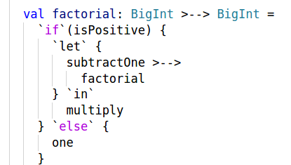

# Program Description Based Programming

## Warning

Expect frequent changes. In the file Changes.md, we describe some of the more important changes. 

## Introduction

When writing an introduction it is challenging to find the right balance between providing *too many details* or *too few details*. This introduction provides many details. It is perfectly fine to read it diagonally.

Before starting, let's present a bit of history.

### History

In 1977, John Backus was an [ACM A.M. Turing Award](http://amturing.acm.org/) winner. The title of his Turing Award winning lecture was 

*Can programming be liberated from the von Neumann style? A functional style and it's algebra of programs.*

This project builds upon the ideas of this influential lecture.


### `FP`

In his Turing Award winning lecture, John Backus describes a [*function level programming language* `FP`](https://en.wikipedia.org/wiki/FP_%28programming_language). 

The `FP` programming language consists of *objects*, *programs*, *forms* and *definitions*, where

 - A program transforms objects to an object.
 - A form transforms programs to a program.
 - A definition defines a program or a form in terms of programs and forms.

The `FP` forms are 

 - *Function*
 - *Composition*
 - *Construction*
 - *Condition*
 - *Aggreation*

`FP` does not really have an aggregation form. It does have objects that are *sequences* of objects. We included aggregation since it consists of, somehow, reducing objects of a structure of objects (for example a sequence of objects) to a single object.

### Mapping from `FP` to `Dotty`

In this project, we develop a *program description library* that is written in the [`Dotty` *programming language*](http://dotty.epfl.ch/). The main `trait` of the library is `trait Program`, a *type class* that closely resembles `FP`.

Below is the logo of the library

```scala
    //       _______         __    __        _______
    //      / ___  /\       / /\  / /\      / ___  /\
    //     / /__/ / / _____/ / / / /_/__   / /__/ / /
    //    / _____/ / / ___  / / / ___  /\ /____  / /
    //   / /\____\/ / /__/ / / / /__/ / / \___/ / /
    //  /_/ /      /______/ / /______/ /     /_/ /
    //  \_\/       \______\/  \______\/      \_\/
    //                                           v1.0
    //  Program Description Based Programming Library
    //  author        Luc Duponcheel        2017-2018
```

Below is the definition of `trait Program`

```scala
trait Program[>-->[- _, + _]]
    extends Function[>-->]
    with Composition[>-->]
    with Construction[>-->]
    with Condition[>-->]
    with Aggregation[>-->]
    with Execution[>-->]
```
The `FP` forms to `trait`'s that are mixed-in by `trait Program`.

*Program descriptions* are defined in terms of the *programming capabilities* that are *declared* in `trait Program`. A *meaning* of a program description is defined by defining an `implicit object` that *defines* the programming capabilities that are declared in `trait Program`. A specific meaning can be made available using a technique, *dependency injection by* `import`, that will be used a lot in this book. For *type classes*, dependency injection in `Dotty` is as simple as doing an appropriate `import`. 

By abuse of notation, we are often going to refer to both *program descriptions* and their *meaning* them as *programs*. We hope that this will not lead to any confusion (especially since *program* is, generally, used to refer to *code written in some programming language*). 

There is are important differences between `FP` programs and `Dotty` programs (program *descriptions*, remember). Exploiting the flexibility that comes with those differences is one of the most important themes of this project. 

 - `FP` programs are *language* based.
 - `Dotty` programs are *library* based.

Therefore

 - in `FP`
   - programs have only *one* meaning,
   - forms cannot be extended.
 - in `Dotty`
   - programs can have *many* meanings,
   - `trait Program` can be extended.

Different meanings can be defined by defining the members of `trait Execution`.

For example:

 - *One* `Dotty` program for `factorial` can have both a meaning that is *not* tail recursive and a meaning that *is* tail recursive.
 - *extra programming capabilities* can be added such as
   - input reading,
   - output writing,
   - state manipulation,
   - failure handling,
   - latency handling (using parallelism),
   - advanced control beyond conditional control (using delimited continuations),
   - ...

In a way programs generalize *functions*. A *function application* (more precisely, the *evaluation* of a *function application expression*) transforms *function arguments* to yield a *function result*. A *program execution* also, *somehow*, transforms *program arguments* to yield a *program result*. When there is no danger of confusion we are simply going to write *arguments* and *result* (not mentioning *function* or *program*).

Our library is also about *computation descriptions*. They are similar to program descriptions. By abuse of notation, we are also often going to refer to both *computation descriptions* and their *meaning* them as *computations*. 

In a way computations generalize *expressions*. An *expression evaluation* yields an *expression result*. A *computation execution* also, *somehow*, yields a *computation result*. When there is no danger of confusion we are simply going to write *result* (not mentioning *function* or *computation*).

Below are some `Dotty` REPL (Read-Eval-Print-Loop) sessions to illustrate the difference between a *description* and it's *meaning*. The `Dotty` code below does *not* deal with programming capabilities or computational capabilities *at all*. Instead it simply deals with *element* related capabilities.

```scala
scala> trait Element[E] {
         val element: E
       }   
defined trait Element
scala> trait Function[E] {
         def function(e: E): E
       }   
defined trait Function
```

Above are two `Dotty` *type classes* for a type `E` declaring element related capabilities.

 - `trait Element[E]` declares `E`s capability to have an element, `element`.
 - `trait Function[E]` declares `E`'s capability to have an function, `function`, that transforms an argument element `e` to yield a result element `function(e)`.

Given those *declarations* we can already start *defining* some *element descriptions* as illustrated below

```scala
scala> trait SomeElement[E : Element : Function] {
         val implicitFunction = implicitly[Function[E]]
         import implicitFunction._
         
         val implicitElement = implicitly[Element[E]]
         import implicitElement._
         
         val someElement = function(element)  
       }   
defined trait SomeElement 
```

The code above defines `trait SomeElement[E : Element : Function]`, that declares `E` to *implicitly* have the element related capabilities above. The code defines an element description `someElement` in terms of those capabilities. Think of the element description as a *recipe*:

 - Take `element` and apply `function` to it to make `someElement`.

At this moment there is *no definition* of the declared capabilities available yet. Let's go ahead and introduce an *implicit definition* of those declared capabilities for the type `Int`:

```scala
scala> implicit object naturalNumbers extends
         Element[Int] with Function[Int] {
         
         override val element: Int = 0
         
         override def function(i: Int): Int = i + 1
         
       }   
defined module naturalNumbers
scala> object someIntElement extends SomeElement[Int]() 
defined module someIntElement
scala> import someIntElement.someElement
import someIntElement.someElement
```

The code above defines `implicit object naturalNumbers` (modeling *natural numbers*). Note that, a long as we keep `Dotty`'s type system happy, we have the *full flexibility* to define `element` and `function` in *any* way we want. We could have modeled *even natural numbers* by replacing `1` by `2`. The code above makes `someElement`, an element of type `Int` available using *dependency injection by* `import`. Now that we have *defined* `E` to be `Int`, we write *element*. When `E` was *declared* we wrote *element description*. Remember that for program descriptions and computation descriptions our notation is *not* going to be so precise. Let's go ahead and make use of `someElement`

```scala
scala> someElement 
val res0: Int = 1
```

### Pointfree versus Pointful

The `FP` programming language imposes a *pointfree programming style* (think of *function level* and *pointfree* as synonyms).

The programming capabilities of `trait Program` also impose a pointfree programming style.
The computational capabilities of `trait Computation` allow a *pointful programming style*(think of *object level*, *value level* and *pointful* as synonyms).

Our library promotes a pointfree programming style. Therefore

 - We declare the members of the `trait Program` to be `public`.
 - We declare the members of the `trait Computation` to be `package` `private`.

### Foundations

Describing programs, resp. computations, using program descriptions, resp. computation descriptions, is not new.

In 1991, Eugenio Moggi introduced *monads* as a *computation* foundation in
[*Notions of computation and monads*](http://citeseerx.ist.psu.edu/viewdoc/download?doi=10.1.1.79.733&rep=rep1&type=pdf).

In 1992, Philip Wadler used monads in `Haskell` in [*The essence of functional programming*](http://citeseerx.ist.psu.edu/viewdoc/download;jsessionid=E09A5FD9362F6780675ADF29471B7428?doi=10.1.1.38.9516&rep=rep1&type=pdf).

In 1998, John Hughes introduced *arrows* as a *program* foundation and used arrows in `Haskell`
[*Generalizing monads to arrows*](http://citeseerx.ist.psu.edu/viewdoc/download?doi=10.1.1.29.4575&rep=rep1&type=pdf).

In 2008, Conor McBride and Ross Paterson introduced *applicatives* (a.k.a. *idioms*) as a *computation* foundation and used applicatives in `Haskell` in [*Applicative programming with effects*](http://www.staff.city.ac.uk/~ross/papers/Applicative.pdf).

In 2008, Sam Lindley, Philip Wadler and Jeremy Yallop compared the *power of expression* of those three foundations in [*Idioms are oblivious, arrows are meticulous,
monads are promiscuous*](http://citeseerx.ist.psu.edu/viewdoc/download?doi=10.1.1.187.6750&rep=rep1&type=pdf). Monads have most power of expression. Applicatives have least power of expression. 

Monads naturally lead to a pointful programming style. Monad based computations can use a pointfree programming style by making use of [*Kleisli functions*](https://en.wikipedia.org/wiki/Kleisli_category). Arrows naturally lead to a pointfree programming style. Arrow based programs can use a pointful programming style by making use of [*The arrow calculus*](http://homepages.inf.ed.ac.uk/slindley/papers/arrow-calculus.pdf).

*Our library goes for programming monads in a pointfree style using Kleisli functions.*

### Why `Dotty`

Program description based programming is not only about *power of expression*, it is also, and probably even more, about *elegance of use*. Traditionally, the pointfree style has *not* been considered to be very elegant. Luckily, the `Dotty` programming language comes to the rescue! `Dotty` is a *strongly typed*, *scalable* programming language. It is possible to *extend the language* in a *type safe* way at the *library* level with *internal domain specific languages*. By making use of a domain specific language for the domain of *programs*, program description based programming can be done in a very *concise* way.

Below are both an `FP` example and a `Dotty` example illustrating difference in elegance of use.

#### `FP factorial`


#### `Dotty factorial`



Of course, elegance of use is a highly subjective concept. Maybe, if you are mathematically inclined, you may consider the `FP` example below to be more elegant. However, if you are a mainstream programmer, you, most probably, consider the `Dotty` example below to be more elegant.

### Main goal of the library

The main *goal* of the library is to illustrate that program description based programming using a pointfree style in `Dotty` is 

 - *powerful* : you can use the full expressive power of monads
 - *elegant* : you can use a concise `Dotty` DSL syntax
 - *flexible* : you can define many meanings
 - *extendible* : you can introduce extra capabilities by need

We claim that program description based programming using a pointfree style
*naturally leads to deep insights into the nature of programming and computation*
since it requires you to reason at an *appropriate level of abstraction*. 

### More about descriptions

Below is a comparision between the universe of *programs* and the universe of *paintings*.

Program descriptions *are* programs (code that is written using a programming language), and giving a *meaning* to program descriptions happens in the universe of programs (code that is written using a programming language). Note that we have been a bit sloppy with our vocabulary, but, hopefully, you get the point.

Compare this with


What is figure above all about?

René Magritte, the painter of [*Ceci n'est pas une pipe*](https://en.wikipedia.org/wiki/The_Treachery_of_Images) was right. His painting *is not a pipe* : it is a *painting* that is a *description of a pipe*. Note that, giving a *meaning* to paintings happens in a universe that is totally different from the universe of paintings. It happens in the universe of human minds.

### Summary

For some of you this introduction may have touched upon a lot of frightening stuff.
But, really, for now you only have to concentrate on *power of expression*,
*elegance of use* and *flexibility of meaning*. Hopefully this will sound exiting to both programmers *with* and programmers *without* a background in computer science.


<!--

-->


